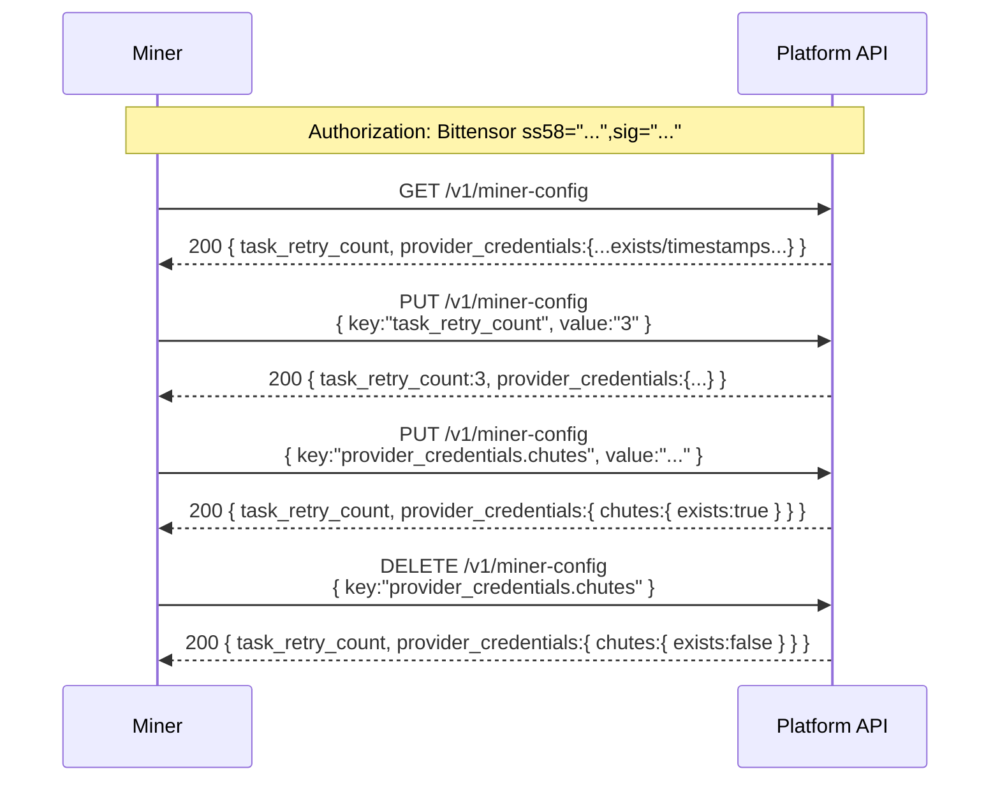
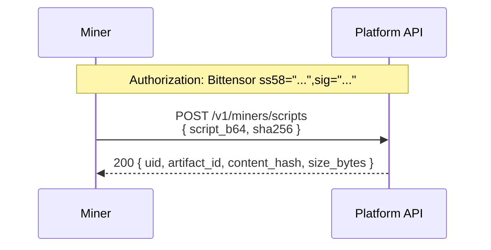
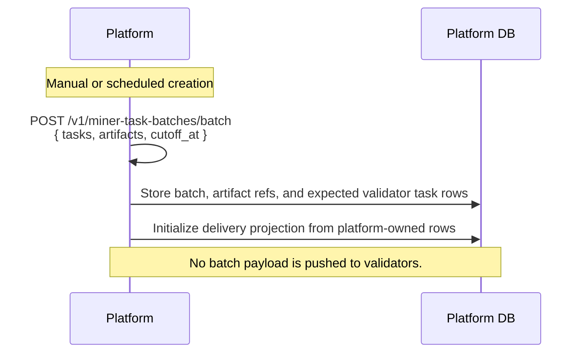
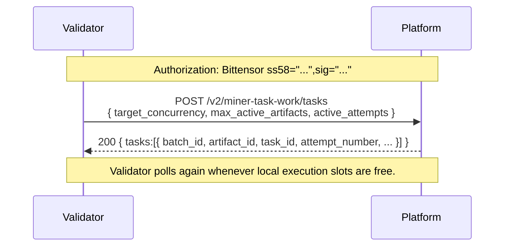
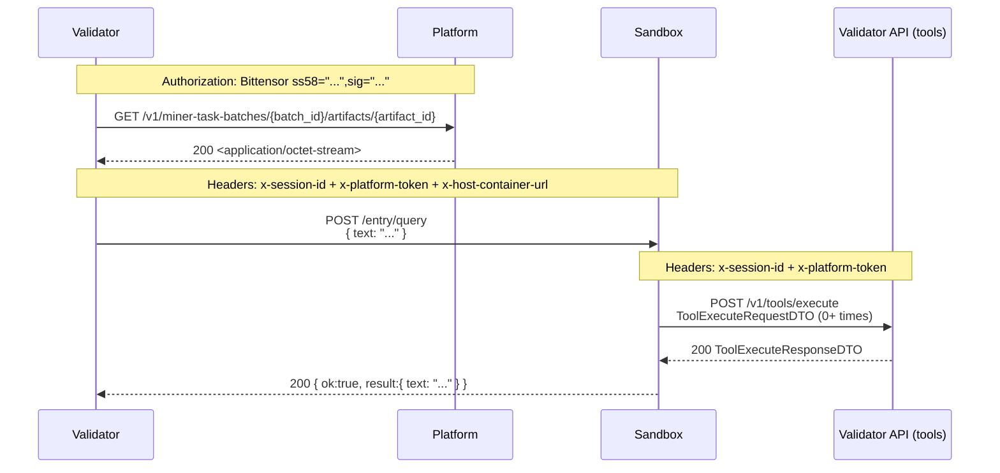
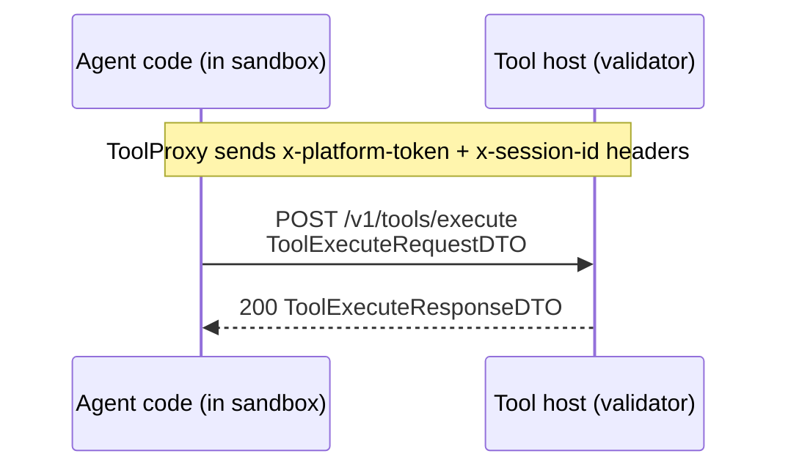
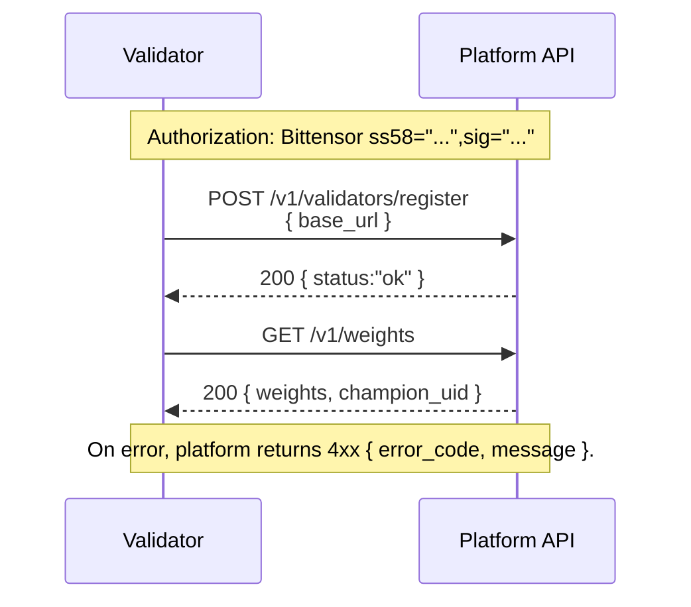

# Harnyx API flows (sequence diagrams)

All Mermaid **sequence diagrams** live here (one document). For request/response shapes, use the generated endpoint references:
- Platform: [generated/platform.md](generated/platform.md)
- Validator: [generated/validator.md](generated/validator.md)
- Sandbox: [generated/sandbox.md](generated/sandbox.md)

## Diagram style

These diagrams are intentionally **linear** (no `alt` / `par` / `loop`) to keep them easy to read. Any optional or repeated behavior is described in short notes next to the diagram.

## Quick index

- Subnet runtime (Platform ↔ Validator ↔ Miner)
  - [Miner config](#miner-config)
  - [Miner script upload](#miner-script-upload)
  - [Miner-task batch](#miner-task-batch)
  - [Tool execution](#tool-execution)
- Subnet ops (Platform ↔ Validator)
  - [Validator registration and weights](#validator-registration-and-weights)

## Flow catalog (fast scan)

| Domain | Flow | Goal | Actors | Auth / Context |
|--------|------|------|--------|------|
| Subnet runtime | Miner config | configure retry count; upload, read, or delete redacted provider credential status | Miner ↔ Platform | `Authorization: Bittensor ...` |
| Subnet runtime | Miner script upload | upload script artifact | Miner ↔ Platform | `Authorization: Bittensor ...` |
| Subnet runtime | Miner-task batch | forward batch to allowlisted validators + run sandbox + poll status and drain run pages | Platform ↔ Validator ↔ Sandbox | `Authorization: Bittensor ...` + `x-platform-token` + `x-session-id` + `x-host-container-url` |
| Subnet runtime | Tool execution | agent invokes host tools | Sandbox agent ↔ Tool host | `x-platform-token` + `x-session-id` |
| Subnet ops | Validator registration and weights | register API base URL; read weights | Validator ↔ Platform | `Authorization: Bittensor ...` |

---

## Subnet runtime (Platform ↔ Validator ↔ Miner)

These flows are the subnet’s core evaluation path.

### Miner config

| Overview | |
|---|---|
| **What’s happening** | Miner manages platform-stored config for a signing hotkey. |
| **Execution status** | Stored provider credentials are used by active miner-task batch execution through scoped platform tool proxy calls. Raw provider API keys are never returned to validators or sandboxes. |
| **Credential cleanup** | On successful metagraph refresh, platform prunes provider credentials for miner hotkeys absent from the refreshed metagraph. Empty registered-hotkey snapshots and suspiciously broad cleanup candidates are skipped. |
| **Actors** | Miner ↔ Platform |
| **Auth** | `Authorization: Bittensor ss58="...",sig="..."` |
| **Happy path** | `GET`, `PUT`, or `DELETE /v1/miner-config` returns retry count and redacted provider status. |



**Endpoints involved**
- Platform:
  - [GET /v1/miner-config](generated/platform.md#endpoint-get-v1-miner-config)
  - [PUT /v1/miner-config](generated/platform.md#endpoint-put-v1-miner-config)
  - [DELETE /v1/miner-config](generated/platform.md#endpoint-delete-v1-miner-config)

---

### Miner script upload

| Overview | |
|---|---|
| **What’s happening** | Miner uploads a script artifact that later becomes a batch candidate. |
| **Actors** | Miner ↔ Platform |
| **Auth** | `Authorization: Bittensor ss58="...",sig="..."` |
| **Happy path** | `POST /v1/miners/scripts` returns `{ artifact_id, ... }` |



**Endpoints involved**
- Platform (miner): [POST /v1/miners/scripts](generated/platform.md#endpoint-post-v1-miners-scripts)

---

### Miner-task batch

| Overview | |
|---|---|
| **What’s happening** | Platform owns the batch work ledger; validator polls for assigned task attempts, fetches artifacts, runs `query`, and submits results back to platform. |
| **Actors** | Platform ↔ Validator worker ↔ Sandbox |
| **Auth** | Validator↔Platform is Bittensor-signed; Validator↔Sandbox uses `x-platform-token` + `x-session-id` + `x-host-container-url`. |
| **Happy path** | materialize expected work → poll task assignment → fetch artifact → run `query` → submit result |
| **Assignment gate** | Platform assigns work only to registered, healthy, metagraph-authorized validators that have a `validator_allowlist_entry` row for `miner_task_batch_delivery`. |

#### 1) Platform creates a batch and materializes expected work



#### 2) Validator polls platform for work



#### 3) Validator fetches artifacts and invokes sandbox query



#### 4) Validator submits task results to platform

```mermaid
sequenceDiagram
  participant V as Validator
  participant P as Platform
  participant DB as Platform DB

  Note over P,V: Authorization: Bittensor ss58="...",sig="..."
  V->>P: POST /v2/miner-task-work/results<br/>{ results:[{ batch_id, artifact_id, task_id, attempt_number, ... }] }
  P->>DB: Accept result idempotently and update run/delivery state
  P-->>V: 200 { results:[{ outcome:"accepted"|"retry_later"|"rejected", canonical:true|false, reason_code:null|"already_accepted"|... }] }
  Note over V: Act only on outcome; reason_code is diagnostic.

  Note over V,P: Validator retries only pending result submissions whose outcome is unknown or transient.
```

**Endpoints involved**
- Platform:
  - [POST /v1/miner-task-batches/batch](generated/platform.md#endpoint-post-v1-miner-task-batches-batch)
  - [GET /v1/miner-task-batches/{batch_id}/artifacts/{artifact_id}](generated/platform.md#endpoint-get-v1-miner-task-batches-batch_id-artifacts-artifact_id)
  - `POST /v2/miner-task-work/tasks`
  - `POST /v2/miner-task-work/results`
- Validator:
  - [GET /validator/status](generated/validator.md#endpoint-get-validator-status)
  - [POST /validator/miner-task-batches/{batch_id}/similarity](generated/validator.md#endpoint-post-validator-miner-task-batches-batch_id-similarity)
  - [POST /v1/tools/execute](generated/validator.md#endpoint-post-v1-tools-execute)
- Sandbox:
  - [POST /entry/{entrypoint_name}](generated/sandbox.md#endpoint-post-entry-entrypoint_name)

---

### Tool execution

| Overview | |
|---|---|
| **What’s happening** | Sandboxed agent code invokes host-managed tools (search/LLM/etc.) over HTTP. |
| **Actors** | Agent (in sandbox) ↔ Tool host (validator) |
| **Auth** | `x-platform-token` + `x-session-id` |
| **Happy path** | `POST /v1/tools/execute` returns `ToolExecuteResponseDTO` |



**Endpoints involved**
- Validator: [POST /v1/tools/execute](generated/validator.md#endpoint-post-v1-tools-execute)

---

## Subnet ops (Platform ↔ Validator)

These flows are about validator lifecycle and platform coordination.

### Validator registration and weights

| Overview | |
|---|---|
| **What’s happening** | Validator registers its public API base URL, then reads the current weights. |
| **Actors** | Validator ↔ Platform |
| **Auth** | `Authorization: Bittensor ss58="...",sig="..."` |
| **Happy path** | `POST /v1/validators/register` → `GET /v1/weights` |
| **Allowlist** | The batch-delivery allowlist does not gate registration or `GET /v1/weights`. |



**Endpoints involved**
- Platform:
  - [POST /v1/validators/register](generated/platform.md#endpoint-post-v1-validators-register)
  - [GET /v1/weights](generated/platform.md#endpoint-get-v1-weights)
